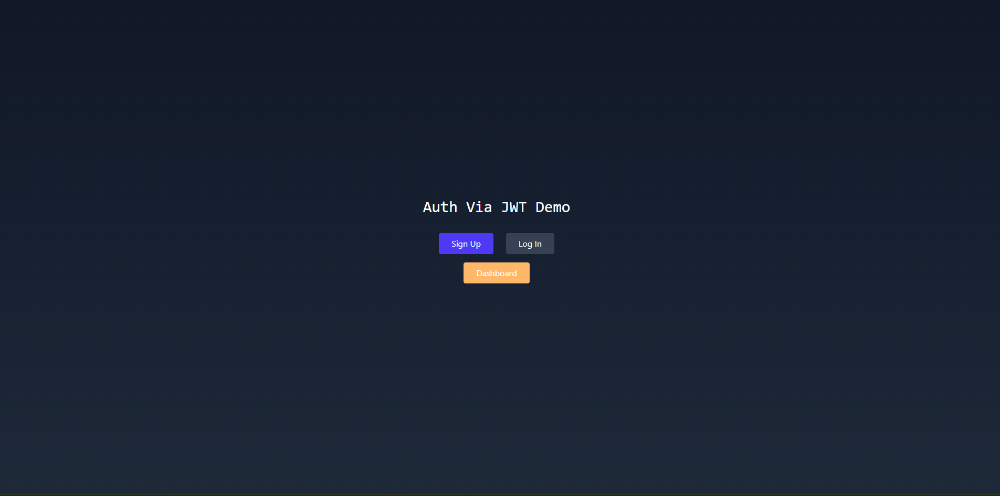
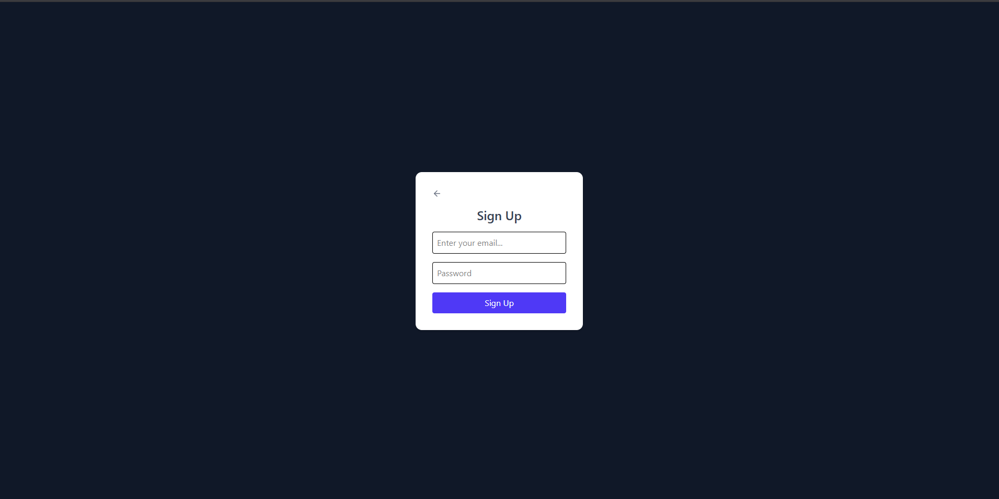
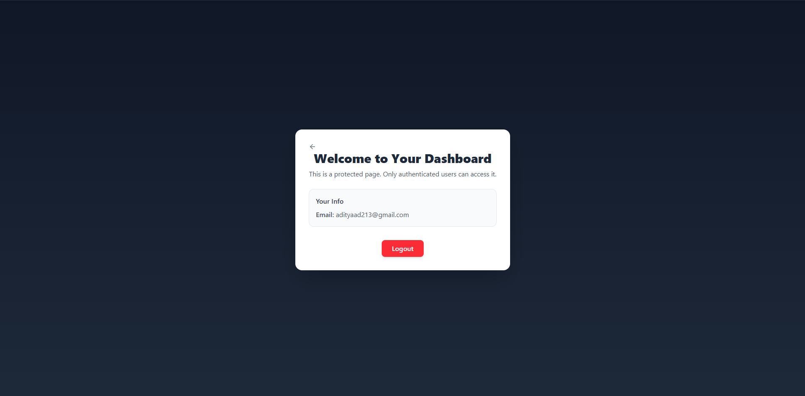

# 🔐 FastAPI + React + MongoDB Auth System

So I built this full stack **Login / Signup system** just to understand how real auth works end to end.  
It turned out way better than I expected 😅

This project uses **FastAPI (backend)**, **React (frontend)** and **MongoDB** for storing user data.  
Everything is connected — you can sign up, login, get JWT token, and access a protected dashboard.

---

## What It Does
- Create account with email + password  
- Login with JWT token authentication  
- Protected Dashboard (only for logged-in users)  
- Passwords are hashed using `bcrypt`  
- Auto logout when token expires  
- SweetAlert popups for clean UI feedback  

---

## Tech Stack
**Frontend:** React + TailwindCSS + SweetAlert2  
**Backend:** FastAPI + Python JWT  
**Database:** MongoDB (Atlas)  
**Auth:** JWT + OAuth2PasswordBearer + bcrypt  

---

## How to Run Locally

### 1. Clone the repo
```bash
git clone https://github.com/AdityaEXP/fastapi-auth-system.git
cd fastapi-auth-system

```

### 2. Build Frontend
```bash
cd frontend
npm run build
cd ..
```

### 3. Setup backend
```bash
cd backend
pip install -r requirements.txt
```

Create ```.env``` file inside backend folder:

```
MONGODB_URL=your_mongo_url_here
```

### 4. Run The Uvicorn Server
```
uvicorn app:app --reload
```

Now open browser → http://localhost:8000
and you’re good to go 

## Screenshots


